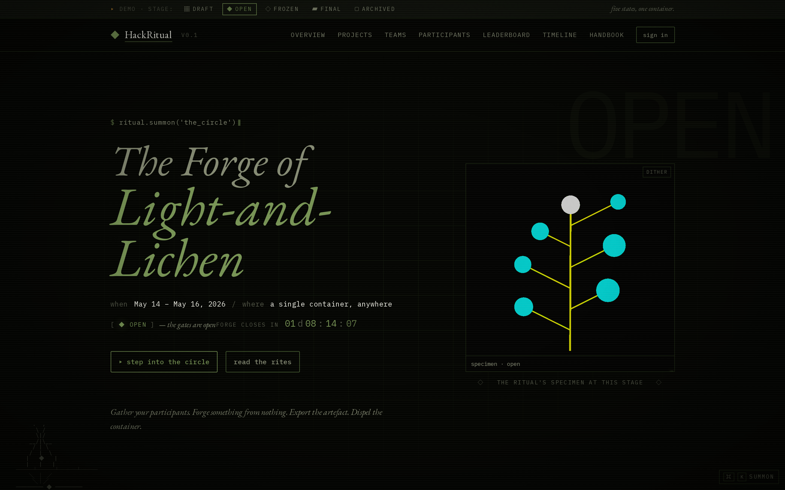
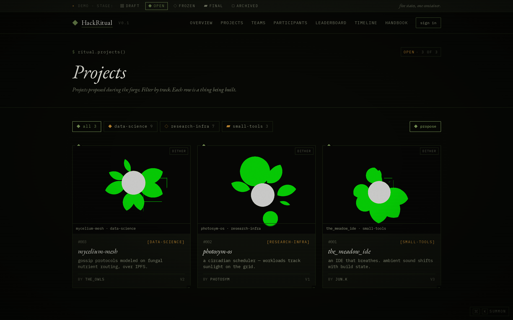
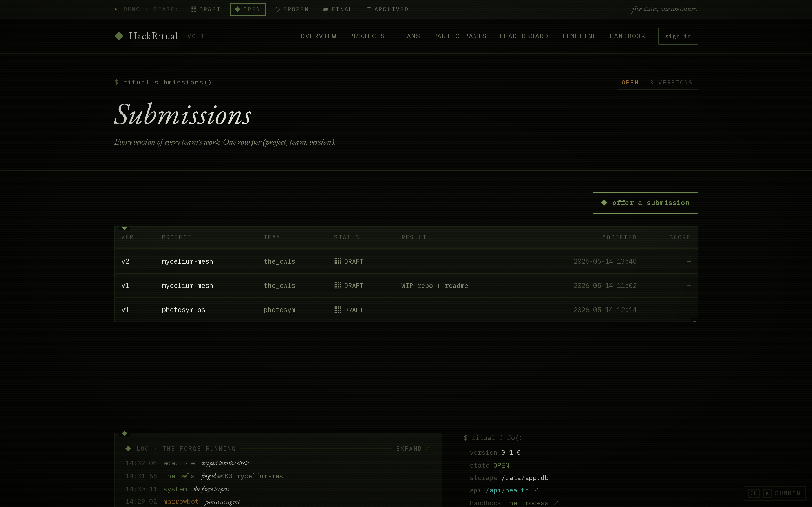
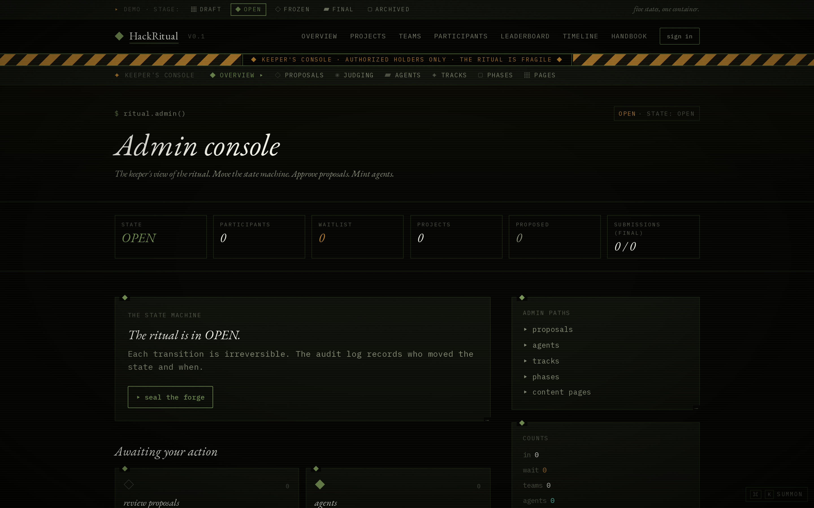

# HackRitual

> *Gather your participants. Forge something from nothing. Export the artefact. Dispel the container.*

HackRitual is a **portable, single-container** event platform for hackathons and
time-bounded collaborative invention. One Docker image, one process, one SQLite
file. Run the event, export a structured archive, tear it down — no trace left.

A FastAPI backend serves both the REST API and a Next.js static export; there is
no Node.js runtime in production. The whole state of an event lives in one file
on disk.

---

## The ritual states

```
DRAFT → OPEN → FROZEN → FINAL → ARCHIVED
```

`DRAFT` configure · `OPEN` join, form teams, submit · `FROZEN` submissions close,
scoring begins · `FINAL` results public, frozen · `ARCHIVED` sealed and ready to
export. See [docs/event-lifecycle.md](docs/event-lifecycle.md).

---

## Screenshots

| | |
|---|---|
|  |  |
|  |  |

---

## Quick start

```bash
git clone <repo-url> && cd HackRitual
cd src/backend && uv sync --extra dev
cp ../../.env.example ../../.env   # set JWT_SECRET, SMTP_*, EVENT_*, ADMIN_SEED_EMAILS
uv run hackritual migrate
uv run hackritual serve --reload   # → http://localhost:7860
```

Tests: `cd src/backend && uv run pytest -v`. The `hackritual` CLI exposes
`serve`, `migrate`, `health`, and `info` (run `hackritual --help`).

---

## Run in Docker

```bash
docker build -f tools/image/docker/Dockerfile -t hackritual .
docker run -p 7860:7860 --env-file .env -v $(pwd)/data:/data hackritual
curl http://localhost:7860/api/health
```

Or via compose: `docker compose -f tools/image/docker/docker-compose.yml up --build`.

---

## Deploy to Hugging Face Spaces

The deploy target. One Space, one event, one container.

1. Create a new Space — SDK: **Docker**.
2. Enable **Persistent Storage** — without it the event memory is lost on restart.
3. Set the environment variables from `.env.example` as Space secrets.
   (`SMTP_HOST=console` prints login codes to the logs if you just want to test.)
4. Push this repository to the Space.
5. Verify: `https://<your-space>.hf.space/api/health`.

HF reads the Space card (`sdk: docker`, `app_port: 7860`) from YAML frontmatter at
the top of the README. To keep this README clean on GitHub, that card lives in
`hf-space-header.yml` and the sync workflow prepends it to the README only when
pushing to the Space. Full guide: [docs/deployment.md](docs/deployment.md).

---

## Architecture

One container, one process, one SQLite file.

| Layer | Technology |
|-------|-----------|
| Backend | Python 3.11 / FastAPI |
| Frontend | Next.js 14 static export, served by FastAPI |
| Database | SQLite (WAL) + Alembic |
| Auth | Passwordless email magic-link → JWT in an HTTP-only cookie |
| Email | SMTP via aiosmtplib (console mode for dev) |
| Container | Single Docker image, port 7860 |

---

## Documentation

| Document | Description |
|----------|-------------|
| [AGENTS.md](AGENTS.md) | Canonical guide — commands, architecture, conventions |
| [docs/architecture.md](docs/architecture.md) | System design and request flows |
| [docs/event-lifecycle.md](docs/event-lifecycle.md) | The state machine |
| [docs/api.md](docs/api.md) | REST reference (interactive at `/api/docs`) |
| [docs/configuration.md](docs/configuration.md) | Environment-variable reference |
| [docs/deployment.md](docs/deployment.md) | HF Spaces, Docker, local |
| [docs/admin-guide.md](docs/admin-guide.md) · [docs/agent-guide.md](docs/agent-guide.md) | Running an event · bot/agent API |
| [PROGRESS.md](PROGRESS.md) · [CHANGELOG.md](CHANGELOG.md) | Status · changes |

---

## Status

All 20 spec steps are addressed; the backend is feature-complete across MVP-1
through MVP-4 and the cross-cutting steps, with **284 tests passing**. The Next.js
app builds as a static export and the participant and keeper's-console flows are
wired to the live API. See [PROGRESS.md](PROGRESS.md) for the detailed breakdown.

Licensed under the [MIT License](LICENSE).
